# Data Flow (JSON Mock -> Actor)

```mermaid
flowchart LR
    jsonMock[objects_mock.json] --> pyValidate[validate_mock_data.py]
    pyValidate --> pyConvert[convert_for_ue_datatable.py]
    pyConvert --> csvData[objects_mock_ue_datatable.csv]
    csvData --> dtAsset[DT_MockScanObjects]
    dtAsset --> mockDataMgr[BP_MockDataManager]
    mockDataMgr --> conveyorBelt[BP_ConveyorBelt]
    conveyorBelt --> scannerActor[BP_CameraScanner]
    scannerActor --> stateManager[BP_StateManager]
    stateManager --> scannerHud[WBP_ScannerHUD]
```

## Runtime contract

1. `BP_MockDataManager.LoadNextObject()` returns the next row from `DT_MockScanObjects`.
2. Spawned object enters conveyor lane and receives metadata payload.
3. `BP_ConveyorBelt` emits `OnObjectEnterScanZone`.
4. `BP_CameraScanner` performs scan and emits `OnScanCompleted`.
5. `BP_StateManager` updates `E_ScanState` and pass/fail counters.
6. `WBP_ScannerHUD` refreshes state and metrics via dispatchers.
